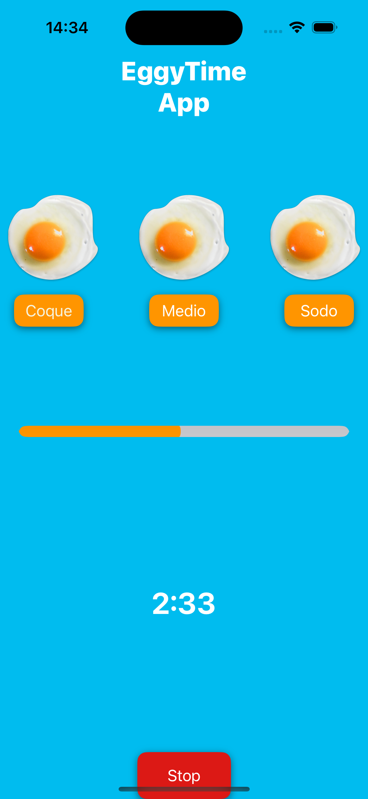

# Eggy-Time-App
# 🥚 Eggy Time App 🕒

Benvenuto in **Eggy Time App**! 🥳 Una semplice e divertente applicazione per aiutarti a cucinare l'uovo perfetto. Che tu voglia un uovo **coque**, **medio**, o **sodo**, abbiamo il timer giusto per te! ⏲️

---

## 🧐 Funzionalità principali

✅ **Tre opzioni di cottura**:  
- 🥚 Coque  
- 🍳 Medio  
- 🍴 Sodo  

✅ **Progress Bar interattiva** per vedere quanto manca.  
✅ **Suono di avviso** 🎵 quando il timer finisce.  
✅ **Interfaccia semplice e intuitiva**: perfetta per chi sta imparando a programmare.  

---

## 📸 Screenshot

Ecco un'anteprima dell'app:  

---

## 🚀 Come funziona?

1. **Scegli il tipo di uovo** che vuoi cucinare (Coque, Medio o Sodo).  
2. Guarda la **Progress Bar** avanzare mentre il timer procede.  
3. Ascolta il suono quando il tuo uovo è pronto. 🎉  

---

## 🛠️ Tecnologie utilizzate

- Swift 🐦  
- UIKit 🖼️  
- Timer ⏳ e Progress Bar 📊  

---

## 🧑‍🍳 Perché scaricarla?

- **Impara a programmare**: Eggy Time App è perfetta per principianti, con un design semplice e funzionalità essenziali.  
- **Cucina senza stress**: Non sbaglierai mai il tempo di cottura!  

---

## 🌟 Contribuisci!

Vuoi migliorare l'app o proporre nuove funzionalità? Sentiti libero di inviare una pull request o aprire una issue. Ogni contributo è benvenuto! 🙌  

---

## 📧 Contatti

Per domande o suggerimenti, scrivimi a: [a.angelo@me.com](mailto:a.angelo@me.com)  

---

> 🥚 **Eggy Time App**: perché il tempo perfetto per cucinare le uova... è tutto!  
